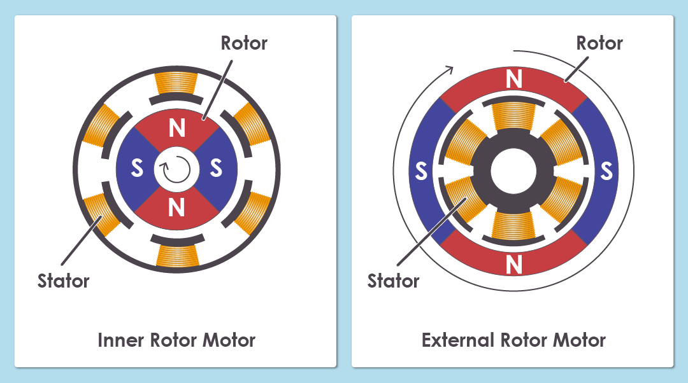
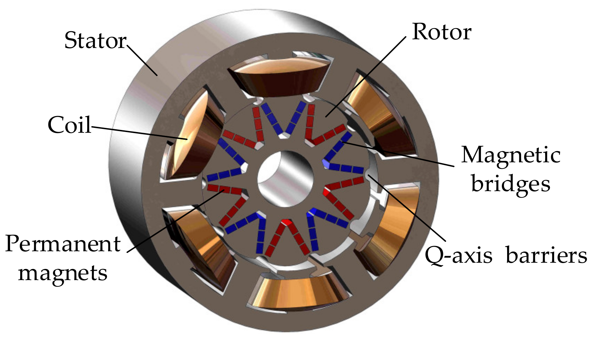

# Motor Research
The research for better motor tech. We will be comparing between different kinds of motors in order to gain a better understanding of them.
### Priorities
- **Efficiency**: Current efficiency range (70/87%), goal (90-95%), efficiency is measured in output power (rpm/torque) per watt.
- **Reliability**: Withstand a long duration of high throttle and extreme conditions of weather.

## BLDC vs PMSM
| Feature                  | **BLDC (Brush-less DC Motor)**          | **PMSM (Permanent Magnet Synchronous Motor)**   |
| ------------------------ | -------------------------------------- | ----------------------------------------------- |
| **Rotor**                | Permanent magnets                      | Permanent magnets                               |
| **Stator winding**       | Trapezoidal                            | Sinusoidal                                      |
| **Back-EMF waveform**    | Trapezoidal                            | Sinusoidal                                      |
| **Control**              | Typically 6-step (commutation)         | Field-Oriented Control (FOC) / sinusoidal       |
| **Torque ripple**        | Higher (due to 6-step commutation)     | Lower (smooth sinusoidal control)               |
| **Efficiency (general)** | Slightly lower                         | Slightly higher                                 |
| **Cost and complexity**  | Lower cost, simpler control            | Higher cost, more complex control               |
| **Applications**         | Fans, RC planes, e-bikes, hobby motors | EVs, drones, industrial drives, high-end motors |

## BLDC - Brush-less DC motor

## PMSM - Permanent Magnet Synchronous Motor
